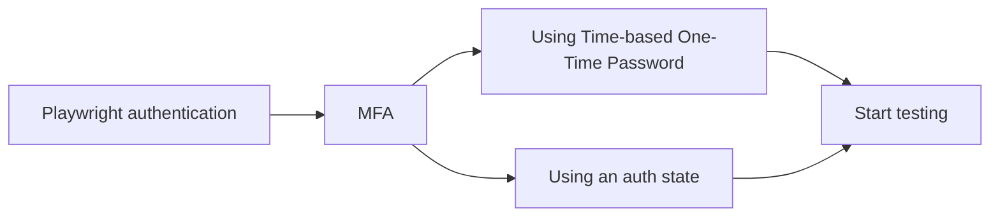

# AUTH

---
layout: section
---

# MFA

---
layout: section
---

# In part 1

## I said to use an account without MFA

---
layout: section
---

# 🤪🔫

---
layout: section
---

# Let us fix that

---

---

# The options

 

> Reference: [Using an authenticated session](https://www.eliostruyf.com/e2e-testing-mfa-environment-playwright-auth-session/)

---
layout: section
---

# Using TOTP

## Time-based One-Time Password

---
layout: section
---

# Creation of TOTP

## Secret key + Current time
