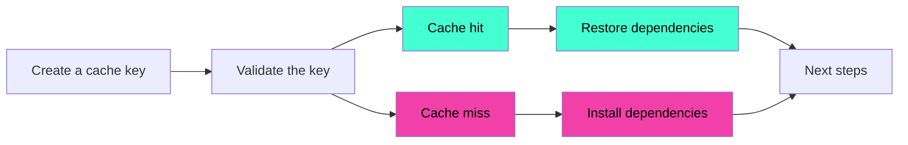

# Step 3

## Adding Playwright to the workflow

---

# Installing NPM dependencies

```yml {all|8-14}
jobs:
  testing:
    runs-on: ubuntu-latest

    steps:
      - uses: actions/checkout@v4

      - uses: actions/setup-node@v4
        with:
          node-version: lts/*
          cache: npm

      - name: Install dependencies
        run: npm ci
```

---

# Installing Playwright

To use Playwright, you need to install the browsers.

```yml
- name: Install Playwright Browsers
  run: npx playwright install --with-deps
```

<br />

> 🚨 Time consuming to install the browsers on every run

---

# Caching

## You can define what to cache with `actions/cache`

<br />



<br />

- **Cache hit**: Cache found, dependencies are restored
- **Cache miss**: No cache found, dependencies are installed
