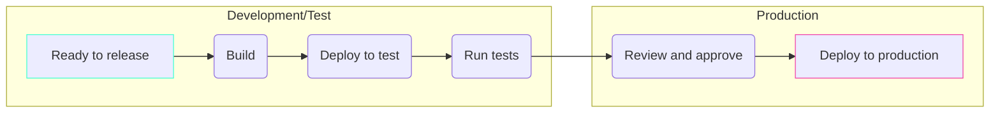

# Step 6

## Deployment environments

---
layout: quote
---

# Ship it!

<style>
  h1 {
    font-size: 150px !important;
    padding: 25px !important;
  }
</style>

---

# Release workflow

<br />
<br />



<dt-show>

## Key considerations

- Define variables and secrets for each **environment**.
- **Separate jobs** and tasks for clarity and maintainability.
- Manage long workflow files by breaking them into smaller, **reusable actions**.
- Implement a **manual approval** step before deploying to production.

</dt-show>

---

# Deployment environments

Manage your **deployment environments**:

- Development
- Test
- Production

Each **environment** has its own:

- Variables (e.g., URL)
- Secrets (e.g., username, password, TOPT secret key)
- Protection rules (e.g., approvals)

---

# Waiting on a successful job

Use the `needs` keyword to wait for a successful job before running the next one.

```yml
jobs:
  build:
    runs-on: ubuntu-latest
    steps:
      ...

  deploy:
    needs: build
    runs-on: ubuntu-latest
    steps:
      ...
```

---

# Workflow templating with composite action

## Composite actions allow you to create reusable actions.

Create a `action.yml` file in the repository (e.g. `.github/actions/build`).

```yml
name: Build action

inputs:
  artifact-name:
    description: Name of the artifact
    required: true

runs:
  using: "composite"
  steps:
    - run: echo "Building the artifact - ${{ inputs.artifact-name }}"
      shell: bash
```

---

# Using the composite action

To use the composite action, reference it in your workflow.

```yml {all|2}
- name: Build the artifact
  uses: ./.github/actions/build
  with:
    artifact-name: "my-artifact"
```
