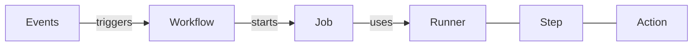

# Step 2

## The workflow

---

# GitHub Actions - Workflow terminology

<br />
<br />



- **Event**: Trigger for a workflow
- **Workflow**: Automation process
- **Job**: Set of steps that execute on the same runner
- **Runner**: VM to execute workflows
- **Step**: A task that can run commands
- **Action**: A reusable task

---
layout: two-columns
---

# Workflow

`.github/workflows/<workflow>.yml`

```yml {all|3-7}
name: E2E Testing

on:
  push:
    branches:
      - main
      - dev

jobs:
  testing:
    runs-on: ubuntu-latest

    steps:
      - uses: actions/checkout@v4
      - uses: actions/setup-node@v4
```

::right::

# When to run?

- On every push to the `branch`
- On a schedule
- On a release

---
layout: two-columns
---

# Run on a schedule

```yml {all|8-10}
name: E2E Testing

on:
  push:
    branches:
      - main
      - dev
  schedule:
    # Run at a specific UTC time
    - cron: "0 6 * * *"

jobs:
  testing:
    runs-on: ubuntu-latest

    steps:
      - uses: actions/checkout@v4
      - uses: actions/setup-node@v4
```

::right::

<br />
<br />

<dt-show>

```
┌───────────── minute (0 - 59)
│ ┌───────────── hour (0 - 23)
│ │ ┌───────────── day of the month (1 - 31)
│ │ │ ┌───────────── month (1 - 12)
│ │ │ │ ┌───────────── day of the week (0 - 6)
│ │ │ │ │
│ │ │ │ │
│ │ │ │ │
* * * * *
```

</dt-show>
